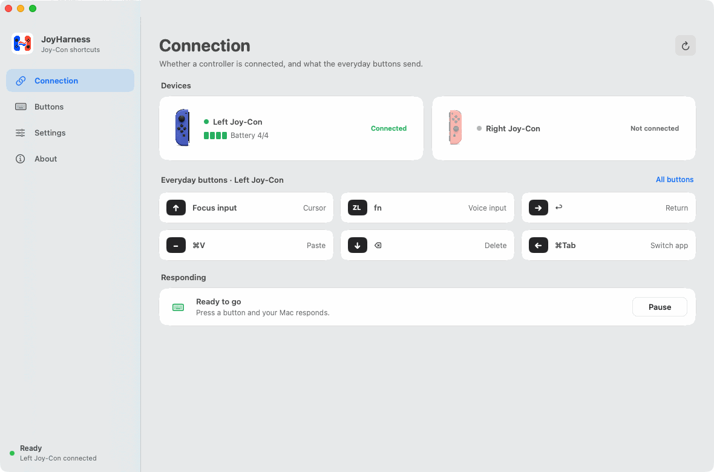
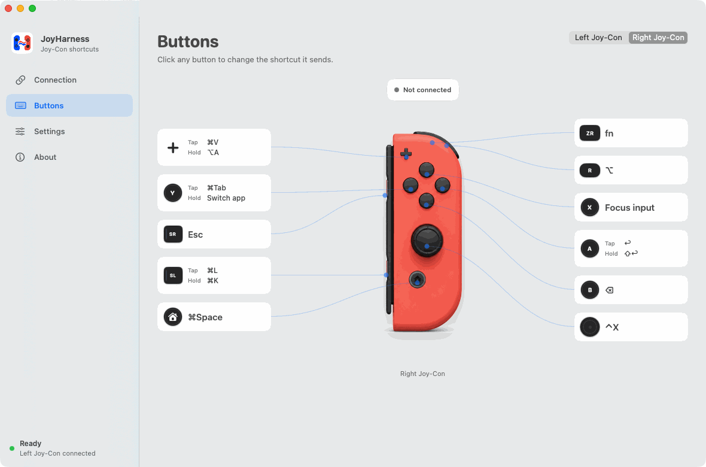

# JoyHarness

[中文](README.md) | English

**Your idle Joy-Con is now a keypad.** Voice input, in your hand.

Install JoyHarness and the Nintendo Switch Joy-Con sitting in your drawer becomes a wireless Bluetooth keypad for your Mac. No opening it up, no modding, nothing to buy: pair it over Bluetooth and it works.

What you'll do most is three presses: `X` puts the cursor in the text field, `ZR` starts talking, `A` sends. One hand holding it does all of it, and the keyboard on the desk can move aside.

## Why I made it

I dictate code and messages all day, far faster than I type. To talk from a reclined chair, I got a desk mic on a boom arm. Still, after every sentence, I had to sit up to hit Return and reach for the mouse. Keypads were either pricey or meant to lie flat on the desk. The Joy-Con in my drawer was made to be held.

[VaderCheng/JoyHarness](https://github.com/VaderCheng/JoyHarness) had already mapped a Joy-Con to keyboard shortcuts in Python. I redesigned the button layout on top of it and built a native Mac app. Beyond code, it fits anything that means a day of talking to a screen, editing and sending: writing, thinking out loud, answering messages.

## What it does, and what it doesn't

JoyHarness reads the buttons on the controller and sends the shortcuts you've set up to macOS. **That's all.**

It **doesn't record audio and doesn't do speech recognition**. Speech is handled by the voice input tool you choose. I use Typeless; any tool that starts from a keyboard shortcut works.

That decides the setup: by default `ZR` sends `fn`, so **set your voice input's start shortcut to `fn` first**, or pressing it does nothing. JoyHarness sends the key; what answers it is that tool's setting.

## Default layout

The most frequent actions sit where your fingers already rest: index finger on `ZR` to talk, thumb on `A` to send. These defaults came from using it every day, and anything awkward was replaced long ago. They're a starting point you can use as is, not a sample configuration.

These are the right Joy-Con's defaults. The left one does the same things **in the same physical positions**: `ZL` for `ZR`, `−` for `+`, and the up/right/down/left buttons for `X`/`A`/`B`/`Y`.

| Button | Does |
| --- | --- |
| `ZR` | Starts voice input (sends `fn`) |
| `R` | Right Option (`⌥`) |
| `+` | Tap to paste (`⌘V`), hold for `⌥A` |
| `A` | Tap to send (`↩`), hold for a new line (`⇧↩`) |
| `B` | Delete (`⌫`), hold to keep deleting |
| `X` | Puts the cursor in the current window's text field |
| `Y` | Tap to switch to the previous app (`⌘Tab`), hold to stay in the switcher and pick with the stick |
| `SL` | Tap for `⌘L`, hold for `⌘K` |
| `SR` | `Esc` |
| `Home` | `⌘Space` |
| Stick | Arrow keys |
| Stick press | `⌃X` |

Every one of them can be changed, except the stick's four directions, which for now only the config file can change.

## Install

You need macOS 13 or later, at least one Joy-Con (left or right) and Bluetooth. Intel and Apple silicon are both supported by the same package.

Download `JoyHarness-macos-<version>.dmg` from [Releases](https://github.com/yongboxia-hue/joyharness/releases/latest), open it, and drag JoyHarness into Applications.

The package is signed with a Developer ID and notarized by Apple, so it opens with a double-click; there's nothing to allow in System Settings. The signature stays the same, so Accessibility is granted once and survives updates.

The first time you open it, a walkthrough grants the permission, pairs the controller, and then has you press each everyday button in a practice conversation.

The app follows your Mac's language: Simplified Chinese on a Mac set to Chinese, English otherwise. You can choose in Settings → Preferences → Language; it applies the next time the app opens.

## Changing buttons

Open Buttons and click any button:

- **One job**: record a shortcut. A press sends it; holding repeats it, like holding a key on a keyboard.
- **Two jobs**: click Add Hold, and a tap and a hold send different shortcuts.

Changes apply at once, and every save is backed up first.

## Holds and buzzes

On a button with two jobs, holding past **0.35 seconds** crosses the hold threshold and the controller buzzes once: you can let go. Every button that tells a tap from a hold uses this one threshold, so a hold feels the same on every button.

In daily use this is the only buzz. Everything else has its result the moment you press, and a buzz would only be noise. A button with one job has no hold, since holding it repeats, so it never buzzes. The other buzz is in the walkthrough: the controller buzzes once when it connects, so you know it's the one in your hand.

## Battery

Reading buttons needs the controller to keep reporting, so while connected it never goes to sleep on its own. **Sleeping when idle is on by default**: after 10 idle minutes the controller disconnects and powers off, and any button wakes and reconnects it. To turn it off, go to Settings → Preferences and switch off Sleep the controller when idle.

## Known limits

- The stick's four directions can only be changed in the config file

## Feedback

If something is awkward, missing or wrong, open an [issue](https://github.com/yongboxia-hue/joyharness/issues).

**On code contributions**: this project doesn't take pull requests for now. I don't have the time to review at that scale, and I'd rather say so up front than waste yours. Real feedback from use, in an issue, is worth more to me.

## License

[MIT](LICENSE). The Python runtime started from [VaderCheng/JoyHarness](https://github.com/VaderCheng/JoyHarness), whose copyright notice is kept in LICENSE.

The controller artwork in the app was made for this project; see [`assets/controller/README.md`](assets/controller/README.md).

JoyHarness is not affiliated with Nintendo. Nintendo Switch and Joy-Con are trademarks of Nintendo, named here only to say which devices it works with.

---

Website: **https://joyharness.pages.dev/en/** | Website source: [joyharness-website](https://github.com/yongboxia-hue/joyharness-website)
