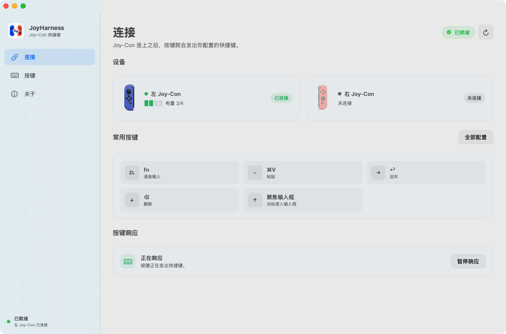
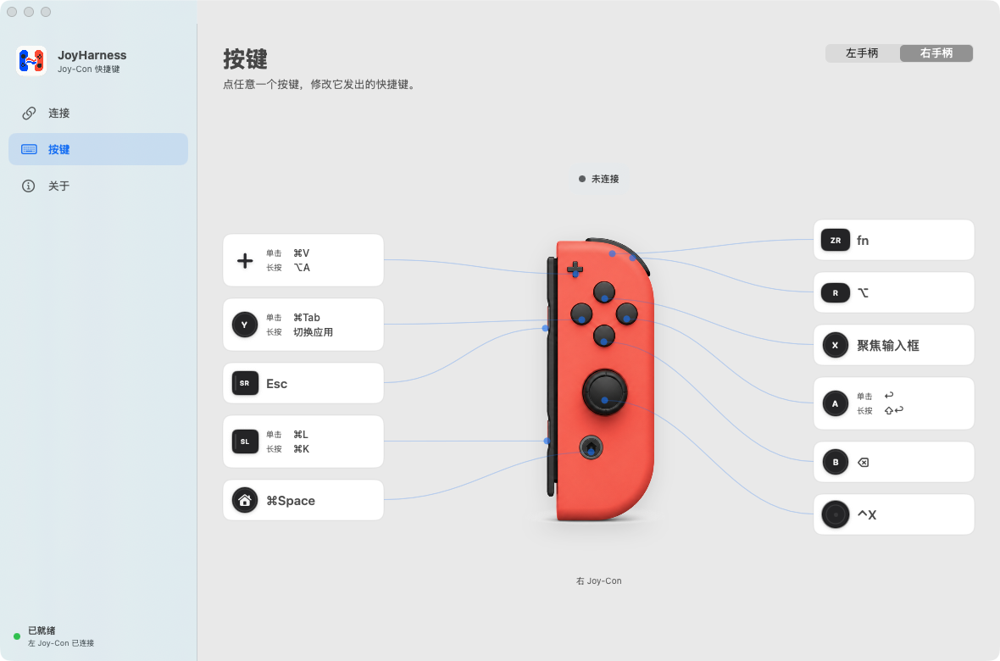

# JoyHarness

**把语音输入，握在手里。**

JoyHarness 让一只闲置的 Nintendo Switch Joy-Con 变成 macOS 上的快捷键控制器。

语音输入已经够快了，但启动听写、确认发送、切换窗口，仍然会把手从鼠标带回键盘。JoyHarness 把这些高频动作放进手柄 —— 你继续看着屏幕、握着鼠标，另一只手就能完成整段表达。

## 它做什么，不做什么

JoyHarness 接收 Joy-Con 的实体按键，把你配置的快捷键发送给 macOS。**就到这里为止。**

它**不录音、不做语音识别**。语音那一段由你自己选的输入法完成 —— 我用的是 Typeless 和豆包，换成任何能用系统快捷键启动的工具都可以。

这一点决定了怎么配：默认映射里 `ZR` 发出的是 `fn`，**你得先在自己的语音输入法里把启动快捷键设成 `fn`**，按下去才会有反应。JoyHarness 只负责把键发出去，谁来接是那个工具的设置。

它最初是为了一边和 AI 对话一边写代码做的，但凡是需要长时间对着屏幕说、改、发的事情都适用：写作整理、日常沟通、处理消息。

## 默认映射

右手柄的默认配置。左手柄在**相同物理位置**提供相同功能：`ZL` 对应 `ZR`，`−` 对应 `+`，方向键的上/右/下/左分别对应 `X`/`A`/`B`/`Y`。

| 按键 | 功能 |
| --- | --- |
| `ZR` | 启动语音输入（发出 `fn`） |
| `R` | 右 Option（`⌥`） |
| `+` | 按一下粘贴（`⌘V`），按住进入连续听写（`⌥A`） |
| `A` | 按一下发送（`↩`），按住换行（`⇧↩`） |
| `B` | 删除（`⌫`），按住连续删 |
| `X` | 把光标放进当前窗口的输入框 |
| `Y` | 按一下切回上一个应用（`⌘Tab`），按住停在切换器里，用摇杆挑 |
| `SL` | 按一下 `⌘L`，按住 `⌘K` |
| `SR` | `Esc` |
| `Home` | `⌘Space` |
| 摇杆推动 | 方向键 |
| 摇杆按下 | `⌃X` |

每一项都可以改 —— 除了摇杆推动的四个方向，那一组目前只能直接改配置文件。

## 安装

需要 macOS 13 或更高版本、至少一只 Joy-Con（左右都行）、蓝牙。Intel 和 Apple Silicon 都支持，同一个安装包通用。

到 [Releases](https://github.com/yongboxia-hue/joyharness/releases/latest) 下载 `JoyHarness-macos-<版本>.dmg`，打开后把 JoyHarness 拖进「应用程序」。

安装包已用 Developer ID 签名并通过 Apple 公证，双击就能打开，不需要在系统设置里额外允许。签名固定，所以辅助功能只需要授权一次，以后升级不用重来。

首次打开会有一段引导：授权、连接手柄，最后跑通一次真实按键。

## 改按键

打开「按键」页，点任意一个按键：

- **做一件事** —— 录一个快捷键。按一下发出它，按住不放会连发，和键盘上按住一个键一样。
- **做两件事** —— 点「添加长按」，按一下和按住分别发出不同的快捷键。

改动立即生效，每次保存前自动备份。

## 长按与震动

配成两件事的按键，按住 **0.35 秒**越过长按阈值时会有一下短震 —— 告诉你可以松手了。所有会区分长按的按键都用这一个阈值，所以「长按」在哪个键上都是同一个手感。

这是唯一会震动的时刻：其他操作按下去就有结果，再震只会变成噪音。只做一件事的按键没有长按这回事，按住它就是连发，也就不会震。

## 省电

读取按键需要手柄持续上报，所以连接期间它不会自己进入休眠。**手柄空闲时自动休眠默认开着**：闲置 10 分钟后手柄会断开并关机，按任意键唤醒重连。不想要就到「关于 → 系统」关掉。

## 已知限制

- 界面仅提供简体中文
- 摇杆推动的四个方向只能改配置文件

## 配件

`assets/3d/` 里有一个可以直接 3D 打印的 **Joy-Con 磁吸麦克风握把**。握着手柄说话时，麦克风就在手上，不用对着屏幕喊。不是必需品，想做就拿去打。

## 反馈

用得不顺、有想要的功能、或者哪里不对，欢迎开 [issue](https://github.com/yongboxia-hue/joyharness/issues)。

**关于代码贡献**：这个项目暂时不接受 PR —— 我没有精力做这个量级的 review，提前说清楚，免得你白花时间。issue 里的真实使用反馈对我更有价值。

## 许可

[MIT](LICENSE)

界面里的手柄图形是本项目自己生成的素材，见 [`assets/controller/README.md`](assets/controller/README.md)。

JoyHarness 与任天堂没有关联。Nintendo Switch 与 Joy-Con 是任天堂的商标，这里仅用于说明兼容哪些设备。

---

官网：[joyharness-website](https://github.com/yongboxia-hue/joyharness-website)
